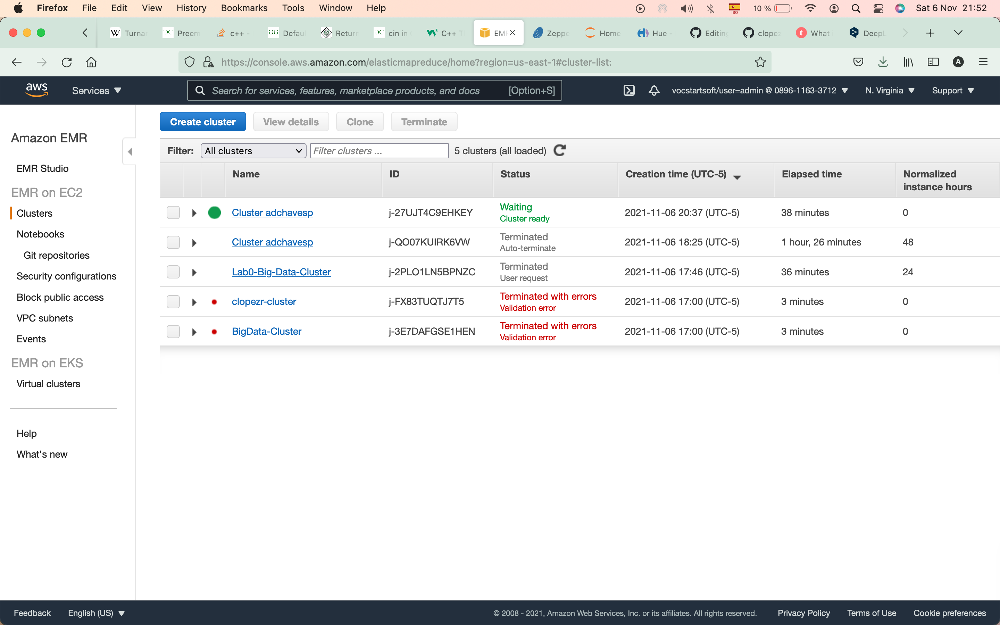
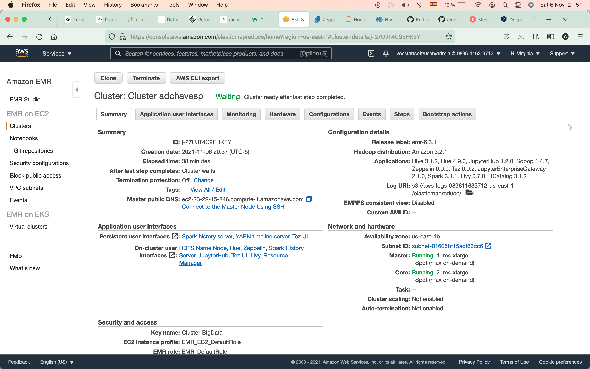
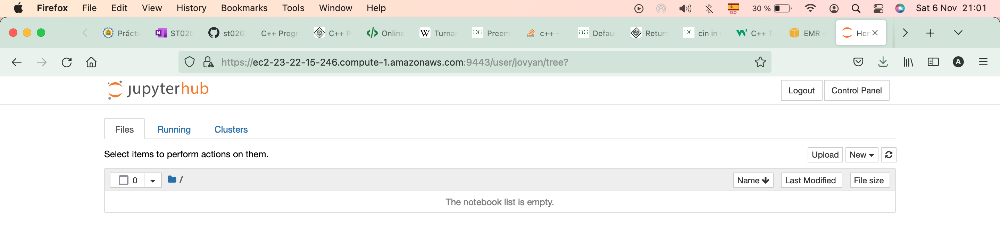
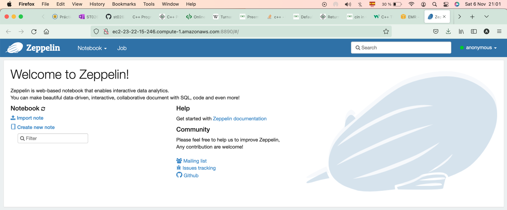
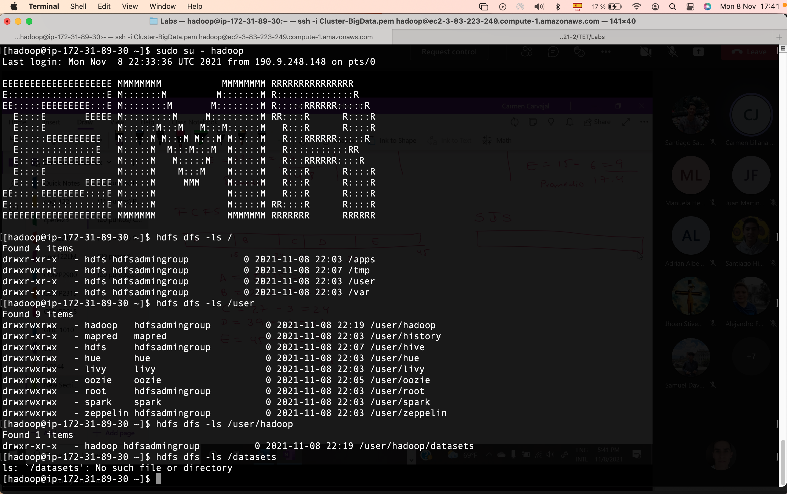
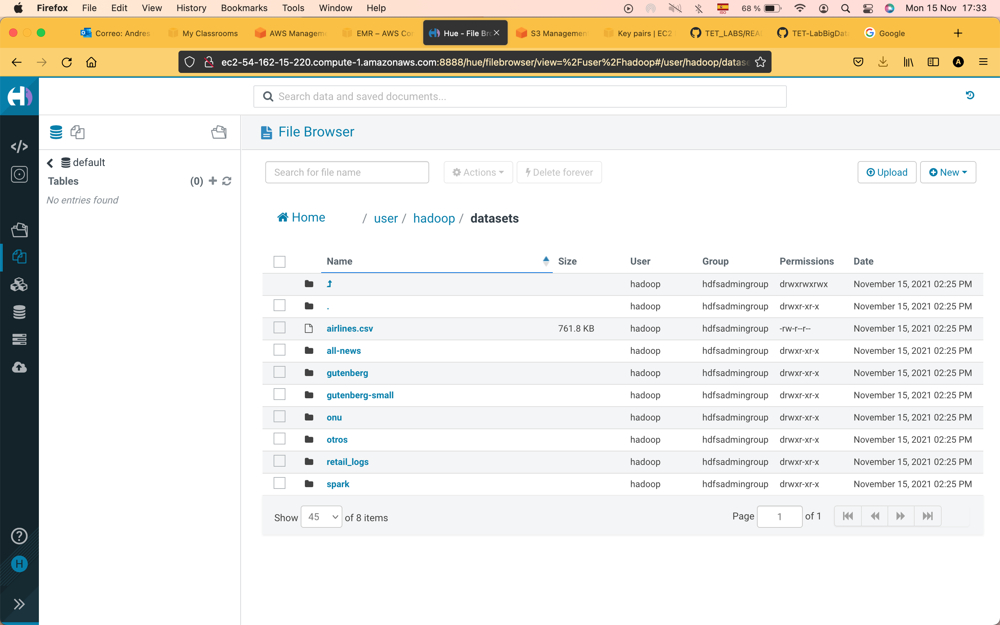
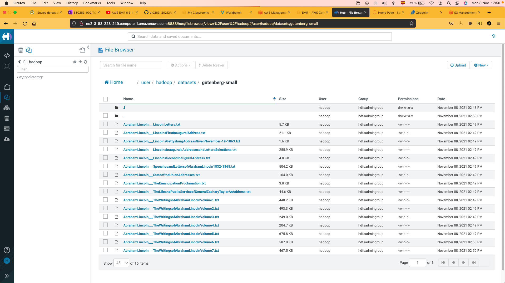
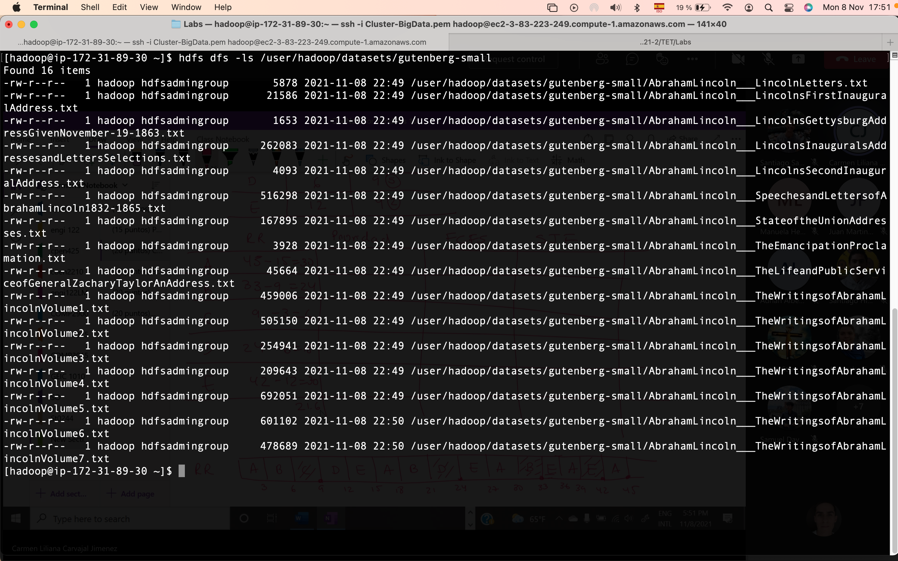

# TET-LabBigData

## Autores: Andrés Darío Chaves Pérez
## Prerrequisitos:

* Cluster De EMR configurado e iniciado.

## Laboratorio 0

En este laboratorio se crerá un cluster de EMR en AWS.
## Conocimientos teoricos
### ¿Qué es un cluster de EMR?
Amazon EMR (antes llamado Amazon Elastic MapReduce) es una plataforma de clústeres administrados que simplifica la ejecución de marcos de big data, como Apache Hadoop y Apache Spark, en AWS para procesar y analizar grandes cantidades de datos. Utilizando estos marcos y los proyectos de código abierto relacionados, puede procesar datos para fines de análisis y cargas de trabajo de inteligencia empresarial. Amazon EMR también le permite transformar y mover grandes cantidades de datos hacia y desde otros almacenes de datos y bases de datos de AWS, como Amazon Simple Storage Service (Amazon S3) y Amazon DynamoDB. 

### ¿Qué es un bucket S3?
S3 significa servicio de almacenamiento simple, y es el servicio de almacenamiento en la nube de AWS. S3 ofrece la posibilidad de almacenar, recuperar, acceder y realizar copias de seguridad de cualquier cantidad de datos en cualquier momento y lugar.

Como S3 es un almacenamiento basado en objetos, esto significa que todos los datos se almacenan como objetos.

Cada objeto tiene tres componentes principales: el contenido del objeto, el identificador único del objeto y los metadatos del objeto (incluyendo su nombre, tamaño y URL).

Un objeto no puede ser independiente, debe existir dentro de un cubo. Puede haber cientos de cubos en cada cuenta de Amazon y dentro de cada cubo, puede haber cientos de objetos. 

### ¿Qué es Hive?
Apache Hive es un sistema de almacén de datos distribuido y tolerante a fallos que permite realizar análisis a gran escala. Un almacén de datos proporciona un depósito central de información que puede analizarse fácilmente para tomar decisiones informadas y basadas en datos. Hive permite a los usuarios leer, escribir y gestionar petabytes de datos mediante SQL.

Hive está construido sobre Apache Hadoop, que es un marco de trabajo de código abierto utilizado para almacenar y procesar eficazmente grandes conjuntos de datos. Por lo tanto, Hive está estrechamente integrado con Hadoop y está diseñado para trabajar rápidamente con petabytes de datos. Lo que hace único a Hive es la capacidad de consultar grandes conjuntos de datos, aprovechando Apache Tez o MapReduce, con una interfaz similar a la de SQL.

### ¿Qué es JupyterHub?
JupyterHub es un entorno de cuaderno Jupyter distribuido alojado en un servidor. JupyterHub permite a los usuarios conectarse a un servidor y escribir código Python dentro de un navegador web sin necesidad de instalar ningún software en su ordenador local. En cualquier lugar donde se tenga una conexión a Internet, se puede abrir una página web de JupyterHub y escribir/ejecutar código Python en un cuaderno Jupyter. Las interfaces de Jupyter notebook y JupyterLab que proporciona JupyterHub es la misma interfaz Jupyter que se ejecuta localmente. Como JupyterHub se ejecuta en un navegador web, funciona incluso en tabletas y teléfonos.

### ¿Qué es Spark?
Spark es un motor de procesamiento de datos distribuido de propósito general que es adecuado para su uso en una amplia gama de circunstancias. Además del motor de procesamiento de datos principal de Spark, existen bibliotecas para SQL, aprendizaje automático, cálculo de gráficos y procesamiento de flujos, que pueden utilizarse conjuntamente en una aplicación. Los lenguajes de programación soportados por Spark son: Java, Python, Scala y R. Los desarrolladores de aplicaciones y los científicos de datos incorporan Spark en sus aplicaciones para consultar, analizar y transformar rápidamente los datos a escala. Entre las tareas más frecuentes asociadas a Spark se encuentran los trabajos por lotes ETL y SQL a través de grandes conjuntos de datos, el procesamiento de datos en flujo procedentes de sensores, IoT o sistemas financieros, y las tareas de aprendizaje automático.

### ¿Qué es Zeppelin?
Un cuaderno basado en la web completamente abierto que permite el análisis interactivo de datos

Apache Zeppelin es un nuevo cuaderno basado en la web y en fase de incubación que aporta a Hadoop y Spark funciones de ingestión de datos, exploración de datos, visualización, intercambio y colaboración.

### Fotos de Reproducción del Lab0 

**NOTA: Este laboratorio tenia como objetivo aprender a crear un cluster EMR con herramientas como los Hive, JupyterHub y Zeppeling, además de hacer uso de un bucket S3 de AWS desde este cluster.**

## Laboratorio 1

### ¿Qué es Hadoop?
Hadoop es un marco de trabajo de código abierto basado en Java que se utiliza para almacenar y procesar big data. Los datos se almacenan en servidores de bajo coste que funcionan como clusters. Su sistema de archivos distribuido permite el procesamiento concurrente y la tolerancia a fallos. Desarrollado por Doug Cutting y Michael J. Cafarella, Hadoop utiliza el modelo de programación MapReduce para un almacenamiento y recuperación más rápidos de los datos de sus nodos. El marco de trabajo está gestionado por la Apache Software Foundation y está licenciado bajo la Apache License 2.0.

### ¿Qué es HDFS?
HDFS es un sistema de archivos distribuido que maneja grandes conjuntos de datos que se ejecutan en hardware básico. Se utiliza para escalar un solo clúster de Apache Hadoop a cientos (e incluso miles) de nodos. HDFS es uno de los componentes principales de Apache Hadoop, los otros son MapReduce e YARN. HDFS no debe confundirse ni reemplazarse por Apache HBase, que es un sistema de administración de bases de datos no relacionales orientado a columnas que se ubica en la parte superior de HDFS y puede soportar mejor las necesidades de datos en tiempo real con su motor de procesamiento en memoria.

### Fotos de Reproducción del Lab1

## Laboratorio 2
### ¿Qué es MRJOB?
mrjob es la famosa biblioteca de Python para MapReduce desarrollada por YELP. La biblioteca ayuda a los desarrolladores a escribir código MapReduce utilizando un lenguaje de programación Python. Los desarrolladores pueden probar el código Python de MapReduce escrito con mrjob localmente en su sistema o en la nube usando Amazon EMR (Elastic MapReduce). Amazon EMR es un servicio web basado en la nube proporcionado por Amazon Web Services para fines de Big Data. mrjob es actualmente un marco activo para la programación de MapReduce o trabajos de transmisión de Hadoop y tiene un buen soporte de documentos para Hadoop con python que cualquier otra biblioteca o marco disponible actualmente. Con mrjob, podemos escribir código para Mapper y Reducer en una sola clase. En caso de que no tengamos Hadoop instalado, también podemos probar el programa mrjob en nuestro entorno de sistema local.

### ¿Qué es MapReduce?
MapReduce es un paradigma de programación que permite una escalabilidad masiva en cientos o miles de servidores en un clúster de Hadoop. Como componente de procesamiento, MapReduce es el corazón de Apache Hadoop. El término "MapReduce" se refiere a dos tareas separadas y distintas que realizan los programas Hadoop. El primero es el trabajo de mapa, que toma un conjunto de datos y lo convierte en otro conjunto de datos, donde los elementos individuales se dividen en tuplas (pares clave / valor).

El trabajo de reducción toma la salida de un mapa como entrada y combina esas tuplas de datos en un conjunto más pequeño de tuplas. Como implica la secuencia del nombre MapReduce, el trabajo de reducción siempre se realiza después del trabajo de mapa.

La programación de MapReduce ofrece varios beneficios para ayudarlo a obtener información valiosa de su big data:
   - Escalabilidad. Las empresas pueden procesar petabytes de datos almacenados en el sistema de archivos distribuido de Hadoop (HDFS).
   - Flexibilidad. Hadoop permite un acceso más fácil a múltiples fuentes de datos y múltiples tipos de datos.
   - Velocidad. Con procesamiento paralelo y movimiento de datos mínimo, Hadoop ofrece un procesamiento rápido de cantidades masivas de datos.
   - Sencillo. Los desarrolladores pueden escribir código en una variedad de lenguajes, incluidos Java, C ++ y Python.

### Referencias
- https://docs.aws.amazon.com/emr/latest/ManagementGuide/emr-what-is-emr.html
- https://blog.lightspin.io/how-to-access-aws-s3-buckets
- https://aws.amazon.com/es/big-data/what-is-hive/
- https://professorkazarinoff.github.io/jupyterhub-engr101/what_is_jupyterhub/
- https://www.cloudera.com/products/open-source/apache-hadoop/apache-zeppelin.html
- https://www.talend.com/resources/what-is-hadoop/
- https://www.ibm.com/topics/hdfs
- https://www.geeksforgeeks.org/hadoop-mrjob-python-library-for-mapreduce-with-example/
- https://www.ibm.com/topics/mapreduce
- https://docs.github.com/en/github/writing-on-github/getting-started-with-writing-and-formatting-on-github/basic-writing-and-formatting-syntax
